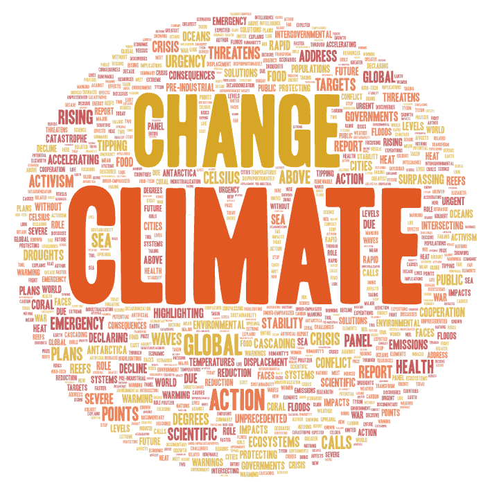

# Climate Change Narratives on YouTube: Discourse and Geography

## Topic and Search Parameters

This project examines how climate change is discussed on YouTube by comparing both language framing and geographic context. I collected video metadata using automated web scraping of YouTube search results.

The following two main dimensions of comparison were used:

### Framing-Based Searches

To examine how climate change discourse varies by rhetorical framing, three distinct groups of search terms were defined and used consistently across data collection. Each group was designed to capture a different narrative orientation commonly observed in public climate discussions.

#### Neutral framing
Neutral terms were selected to capture general, descriptive, or informational discussion of climate change without implying urgency or skepticism:

- climate change  
- climate science  
- carbon emissions  

#### Alarmist framing
Alarmist terms were chosen to emphasize urgency, crisis, and severe consequences, reflecting narratives that frame climate change as an immediate and escalating threat:

- climate crisis  
- climate emergency  
- climate catastrophe  

#### Dismissive framing
Dismissive terms were selected to capture skeptical or denial-oriented narratives that question the legitimacy, severity, or motivations behind climate change discourse:

- climate change hoax  
- global warming hoax  
- climate change scam

### Location-Based Searches

To compare how climate change discourse differs across places with varying levels of climate exposure, two geographically distinct groups of U.S. cities were defined. These groups were based on commonly cited climate vulnerability factors such as extreme heat, flooding, drought, and sea-level rise.

#### High-risk locations
These cities were selected because they are frequently identified as having higher exposure to climate-related risks, either due to geography, climate trends, or urban vulnerability:

- New Orleans, LA (29.9511, -90.0715)  
- Virginia Beach, VA (36.8529, -75.9780)  
- Baltimore, MD (39.2904, -76.6122)  
- San Jose, CA (37.3382, -121.8863)  
- Riverside, CA (33.9806, -117.3755)  
- Phoenix, AZ (33.4484, -112.0740)

#### Lower-risk locations
These cities were selected as locations with comparatively lower immediate climate exposure within the scope of this exercise, particularly in terms of extreme heat and coastal flooding:

- Akron, OH (41.0814, -81.5190)  
- Cleveland, OH (41.4993, -81.6944)  
- Columbus, OH (39.9612, -82.9988)  
- Dayton, OH (39.7589, -84.1916)  
- Toledo, OH (41.6528, -83.5379)  
- Pittsburgh, PA (40.4406, -79.9959)  
- Grand Rapids, MI (42.9634, -85.6681)

#### Search query construction
For each city listed above, the same set of location-specific climate queries was used to ensure consistency across locations and to focus the results on locally relevant content. The following query patterns were applied (with `{city}` replaced by the full city name):

1. climate change `{city}`  
2. climate impacts `{city}`  
3. extreme weather `{city}`  

## Motivation for the Comparison

I chose this topic because climate change is an issue that is discussed in many different ways, depending on both the language used and the real-world conditions people experience. The same underlying scientific topic can be framed as an urgent crisis, a neutral scientific process, or something that is questioned or dismissed. By selecting three distinct framing categories, alarmist, neutral, and dismissive, this project is designed to capture how different word choices reflect different interpretations, priorities, and attitudes toward climate change. These terms were chosen to represent common ways the issue is described in public discourse, allowing the analysis to compare how emphasis on urgency, neutrality, or skepticism shapes the language that appears in climate-related content.

In addition, I included a location-based comparison to examine whether local environmental conditions are associated with differences in how climate change is discussed. Cities identified as higher-risk were selected because they are more frequently linked to extreme heat, flooding, drought, or sea-level rise, while lower-risk cities were chosen to represent areas where these impacts may be less immediately visible in daily life. This design allows the project to explore whether communities facing more direct climate-related challenges tend to use more concrete, impact-focused language, and whether areas with lower immediate exposure show different patterns in emphasis or framing. Together, these choices help isolate how both terminology and geographic context may influence the way climate change is discussed.

## Comparison of Word Clouds

**Word Cloud 1 - Neutral Framing**  

**Word Cloud 2 - Alarmist Framing**  

**Word Cloud 3 - Dismissive Framing**  

**Word Cloud 4 - Lower-Risk Locations**  

**Word Cloud 5 - High-Risk Locations**  

Across the three framing-based word clouds, clear differences emerge in both tone and thematic emphasis. The neutral framing cloud is characterized by language associated with communication, institutions, and general understanding rather than extreme urgency or outright rejection. Prominent terms such as _media_, _public_, _policy_, _scientists_, _coverage_, _communities_, _understanding_, and _discuss_ suggest that neutral searches tend to surface content focused on how climate change is explained, debated, and interpreted in public and academic contexts. Rather than emphasizing either crisis or denial, this framing presents climate change as an issue to be examined, communicated, and managed, reflecting a descriptive and governance-oriented style of discourse.

The alarmist framing cloud shows a pronounced shift toward urgency, severity, and global consequence. Large and frequent terms such as _crisis_, _emergency_, _threatens_, _rising_, _action_, _sea_, _floods_, _droughts_, _oceans_, _emissions_, and _ecosystems_ indicate a focus on escalating impacts and immediate risk. The visibility of words tied to global systems and institutional thresholds (such as _tipping_, _targets_, _panel_, _report_, and _intergovernmental_) further reinforces a narrative centered on large-scale danger and the need for rapid response. Compared to the neutral cloud, the alarmist cloud is more impact-driven and forward-looking, framing climate change as an unfolding emergency.

The dismissive framing cloud stands apart most clearly by centering on dispute and credibility rather than environmental processes or impacts. Terms such as _claims_, _arguments_, _debates_, _questions_, _skepticism_, _hoax_, _scam_, _exaggerated_, and _alarmism_ are visually prominent, alongside political and media-related language. In this framing, climate change appears less as a physical or environmental issue and more as a contested narrative, emphasizing conflict over evidence, authority, and interpretation.

The location-based word clouds introduce a spatial contrast that complements the framing patterns. The lower-risk locations cloud emphasizes broader regional and observational language, with frequent references to _lake_, _temperature_, _weather_, _seasons_, _river_, _rainfall_, _scientists_, _researchers_, and _events_. While risk-related terms such as _risk_ and _extreme_ appear, the overall vocabulary suggests a more analytical and monitoring-oriented discourse. Climate change in these locations is framed largely through patterns, measurements, and long-term variability rather than persistent, localized hazards.

In contrast, the high-risk locations cloud shows a stronger concentration of hazard- and impact-specific terms, including _sea_, _level_, _coastal_, _flood_, _storm_, _drought_, _wildfire_, _water_, _infrastructure_, _displaced_, and _communities_. The prominence of city and state names such as _New Orleans_, _Arizona_, _Louisiana_, _Phoenix_, _Riverside_, and _Virginia_ visually anchors climate change to particular vulnerable places. This pattern reflects a discourse more tightly connected to lived environmental pressures, with language focused on direct exposure and consequences for housing, infrastructure, and daily life.

Taken together, all five word clouds show that framing and geography shape climate change discourse in complementary ways. Neutral and lower-risk clouds both emphasize explanation, research, and general patterns, while alarmist and high-risk clouds share a stronger focus on hazards, urgency, and concrete impacts. The dismissive cloud remains distinct by shifting attention away from environmental conditions and toward ideological and rhetorical conflict. Overall, the comparison suggests that climate change narratives vary not only by how the issue is framed, but also by how directly its effects are experienced.

## Possible Reasons for Observed Patterns

The location-based patterns likely reflect differences in lived environmental exposure and the extent to which climate impacts are experienced as part of everyday life. In high-risk locations, frequent encounters with extreme heat, flooding, drought, wildfires, and coastal threats make climate change more tangible and locally salient. This helps explain why discourse in these regions emphasizes hazards, infrastructure, water, and community impacts, as the language reflects conditions that residents and local institutions directly contend with. In contrast, lower-risk locations may encounter fewer highly visible or recurring climate disasters, leading climate change to be discussed more through observation and long-term trends. This supports a vocabulary centered on weather, seasons, lakes, rivers, and research, reinforcing a more analytical and monitoring-oriented style of discourse rather than one centered on acute crisis.

Framing-based patterns are likely driven by how search terms signal intent and shape the type of content that is surfaced. Alarmist terms prioritize urgency and threat, which aligns with videos emphasizing dramatic impacts, institutional warnings, and calls for rapid action. This naturally produces vocabulary focused on crisis, emergency, rising risks, and large-scale consequences. Neutral terms, by contrast, are more likely to retrieve explanatory, policy-oriented, and media coverage content, producing language centered on understanding, governance, scientific institutions, and public communication. Dismissive terms are designed to challenge legitimacy, leading to content that foregrounds debate, skepticism, and rhetorical conflict. As a result, dismissive framing shifts attention away from environmental conditions and toward disputes over credibility, motive, and narrative control.

The systematic alignment between framing and geography suggests that these two factors can reinforce one another. In regions where climate impacts are more visible, urgent framing may be more prevalent, resonate more strongly with audiences, and be more frequently produced and consumed. Conversely, in areas with fewer immediate or dramatic impacts, more neutral and analytical framing may dominate. This interaction helps explain the observed similarities between alarmist framing and high-risk locations, as well as between neutral framing and lower-risk locations. Together, these dynamics indicate that climate change discourse is shaped not only by ideological framing choices, but also by regional experience, with lived environmental exposure amplifying the tone and focus of climate narratives.

## Possible Future Improvements

Future work could strengthen this analysis by expanding both the scope and diversity of the data collection. Incorporating a larger and more varied set of search terms within each framing category would help reduce reliance on a small number of phrases and better capture the full range of discourse styles present on YouTube. Similarly, including additional cities across different regions, population sizes, and climate contexts, such as rural areas, inland regions, and cities outside the United States, would improve the generalizability of the findings. This would make it easier to distinguish whether observed patterns are driven primarily by climate exposure, regional media ecosystems, demographic factors, or broader cultural and political contexts.

In addition, future research could move beyond word frequency alone to incorporate more sophisticated analytical techniques. Methods such as topic modeling, sentiment analysis, and entity recognition would allow for deeper examination of how themes, emotional tone, and institutional actors differ across framing and location. Collecting data over longer time periods or at multiple points in time would also make it possible to assess how discourse shifts in response to major climate events, policy announcements, or media cycles. Together, these improvements would help separate short-term, event-driven effects from more stable patterns in climate change narratives, producing a more robust and nuanced understanding of how framing and geography shape online climate discourse.

## Surprising and Unexpected Findings

One of the most striking findings was how little the dismissive framing word cloud overlapped with the other four clouds. Unlike the neutral, alarmist, and location-based clouds, which shared several themes related to impacts, institutions, and environmental conditions, the dismissive cloud was dominated by a separate set of rhetorical and credibility-focused terms. This suggests that dismissive discourse is not commonly surfaced through general or impact-oriented searches, but instead appears primarily when users explicitly search using skeptical or denial-oriented language. In other words, dismissive content seems to exist in a more isolated narrative space, rather than being naturally interwoven into broader climate change discussions.

This separation points toward the possibility of echo chamber dynamics within climate-related content. When dismissive language is used, the resulting content appears to reinforce a self-contained discourse centered on skepticism and ideological conflict, with relatively little crossover into discussions of physical impacts or scientific processes. This implies that users engaging with dismissive framing may be exposed to a narrower and more internally consistent set of narratives, while users engaging with neutral or alarmist framing are more likely to encounter content grounded in environmental impacts and institutional sources. The limited overlap across clouds highlights how framing choices may shape not only tone, but also the informational environment users are likely to encounter.

Another unexpected pattern across nearly all five word clouds was the relative absence of strong solution-oriented language. While impacts, risks, and debates were highly visible, there were comparatively fewer dominant terms related to adaptation, mitigation, resilience, or concrete policy responses. This suggests that much of the discourse surfaced through these searches is oriented more toward describing problems or contesting narratives than toward sustained discussion of practical responses. This gap stood out because it indicates that even in high-risk locations and alarmist framing, where urgency is high, the dominant vocabulary still centers more on consequences than on actionable pathways forward.
